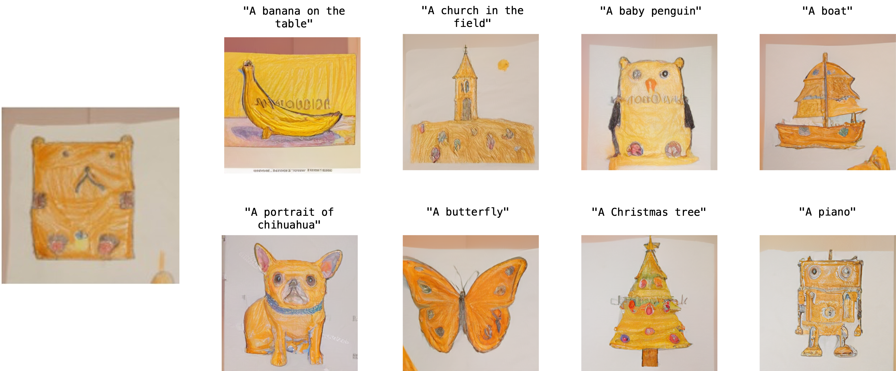

# StyleDrop
This is an unofficial PyTorch implementation of [StyleDrop](https://arxiv.org/abs/2306.00983).

Unlike the parameters in the paper in (Round 1), we set $\lambda_A=2.0$, $\lambda_B=5.0$ and `d_prj=32`, `is_shared=False`, which we found work better, these hyperparameters can be seen in `configs/custom.py`.

we release them to facilitate community research.


<br/><br/>

<br/><br/>

<br/><br/>

<br/><br/>


## Todo List
- [x] Release the code.
- [x] Add gradio inference demo.
- [ ] Add iterative training (Round 2).

## Data & Weights Preparation
First, download VQGAN from this [link](https://drive.google.com/file/d/13S_unB87n6KKuuMdyMnyExW0G1kplTbP/view) (from [MAGE](https://github.com/LTH14/mage), thanks!), and put the downloaded VQGAN in `assets/vqgan_jax_strongaug.ckpt`.

Then, download the pre-trained checkpoints from this [link](https://huggingface.co/nzl-thu/MUSE/tree/main/assets/ckpts) to `assets/ckpts` for evaluation or to continue training for more iterations.

finally, prepare empty_feature by runnig command `python extract_empty_feature.py`

And the final directory structure is as follows:
```
.
├── assets
│   ├── ckpts
│   │   ├── cc3m-285000.ckpt
│   │   │   ├── lr_scheduler.pth
│   │   │   ├── nnet_ema.pth
│   │   │   ├── nnet.pth
│   │   │   ├── optimizer.pth
│   │   │   └── step.pth
│   │   └── imagenet256-450000.ckpt
│   │       ├── lr_scheduler.pth
│   │       ├── nnet_ema.pth
│   │       ├── nnet.pth
│   │       ├── optimizer.pth
│   │       └── step.pth
│   ├── fid_stats
│   │   ├── fid_stats_cc3m_val.npz
│   │   └── fid_stats_imagenet256_guided_diffusion.npz
│   ├── pipeline.png
|   ├── contexts
│   │   └── empty_context.npy
└── └── vqgan_jax_strongaug.ckpt

```


## Dependencies
Same as [MUSE-PyTorch](https://github.com/baaivision/MUSE-Pytorch).
```
conda install pytorch torchvision torchaudio cudatoolkit=11.3
pip install accelerate==0.12.0 absl-py ml_collections einops wandb ftfy==6.1.1 transformers==4.23.1 loguru webdataset==0.2.5
```

## Train
All style data in the paper are placed in the data directory

1. Modify `data/one_style.json` (It should be noted that `one_style.json` and `style data` must be in the same directory), The format is `file_name:[object,style]`

```json
{"image_03_05.jpg":["A bear","in kid crayon drawing style"]}
```
2. Training script as follows.
```shell
#!/bin/bash
unset EVAL_CKPT
unset ADAPTER
export OUTPUT_DIR="output_dir/for/this/experiment"
accelerate launch --num_processes 8 --mixed_precision fp16 train_t2i_custom_v2.py --config=configs/custom.py
```


## Inference

The pretrained style_adapter weights can be downloaded from [🤗 Hugging Face](https://huggingface.co/zideliu/StyleDrop/tree/main).
```shell
#!/bin/bash
export EVAL_CKPT="assets/ckpts/cc3m-285000.ckpt" 
export ADAPTER="path/to/your/style_adapter"

export OUTPUT_DIR="output/for/this/experiment"

accelerate launch --num_processes 8 --mixed_precision fp16 train_t2i_custom_v2.py --config=configs/custom.py
```


## Gradio Demo
Put the [style_adapter weights](https://huggingface.co/zideliu/StyleDrop/tree/main) in `./style_adapter` and run the following command will launch the demo:

```shell
python gradio_demo.py
```


## Acknowlegment

* The implementation is based on [MUSE-PyTorch](https://github.com/baaivision/MUSE-Pytorch)
* Many thanks for the generous help from [Zanlin Ni](https://github.com/nzl-thu)
